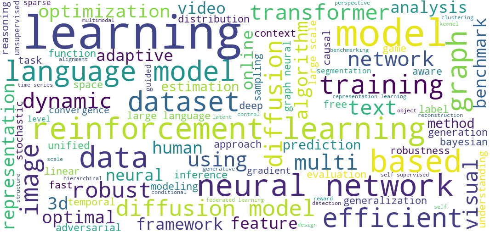
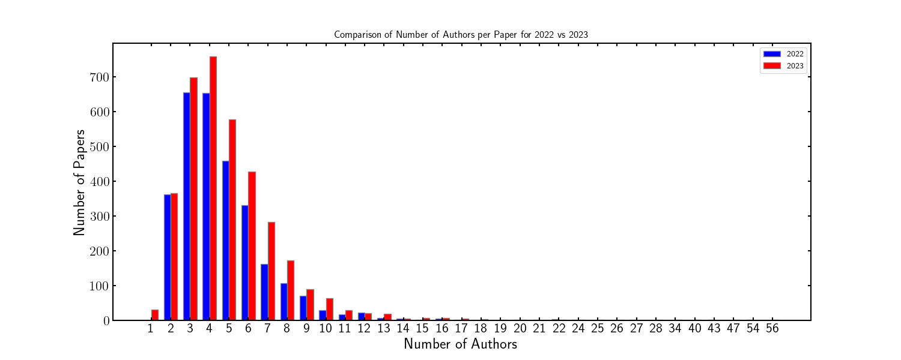
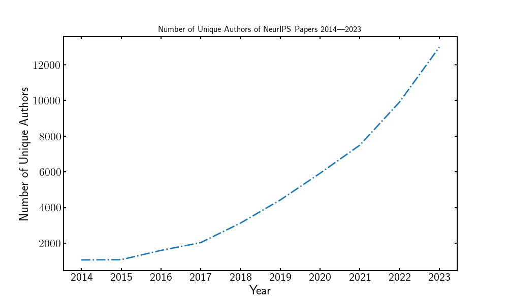
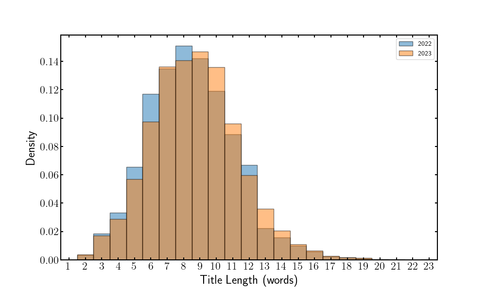
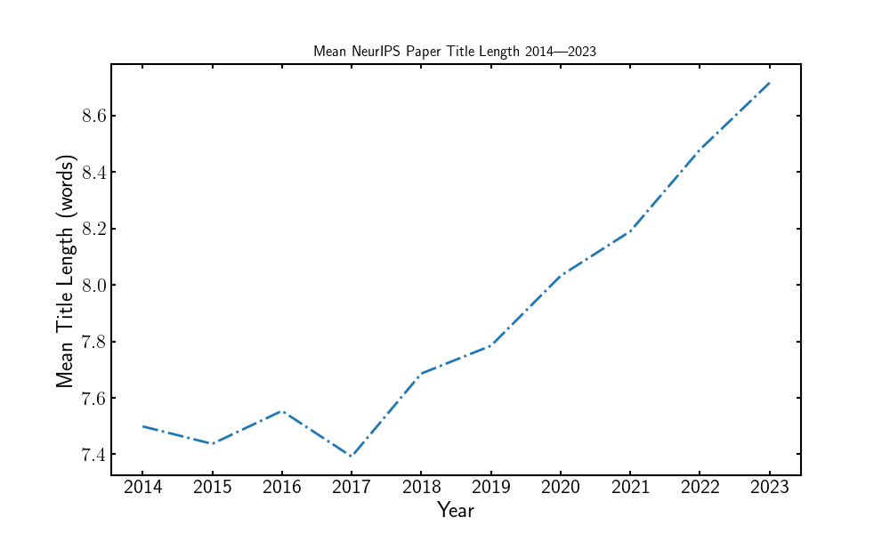
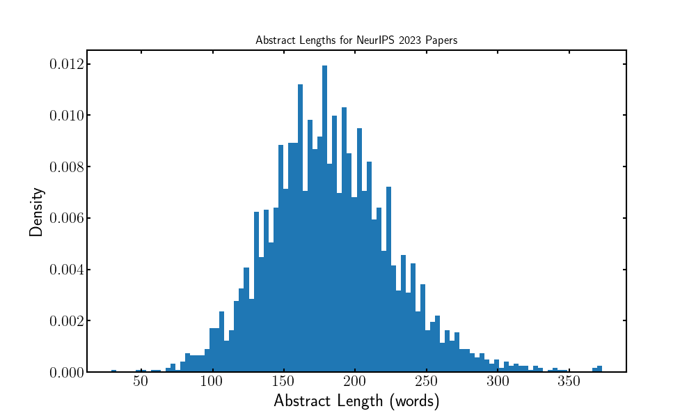

# Awesome NeurIPS 2023 Info

Caption: Wordcloud of all NeurIPS 2023 titles

Welcome to the hub for all things [NeurIPS 2023](https://neurips.cc/)! We scraped the data for all 3500+ NeurIPS projects and dove into the depths of Hugging Face, GitHub, LinkedIn, and Arxiv to pick out the most interesting content.

In this repo, you will find:

- [Data Analysis](#data-analysis): detailed analysis of the titles and abstracts from NeurIPS 2023 accepted papers
- [Awesome Projects](#cool-neurips-projects): synthesized collection of 40 NeurIPS 2023 papers you won't want to miss
- [Conference Schedule](#conference-schedule): comprehensive listing of all NeurIPS 2023 projects (title, authors, abstract) organized by poster session and sorted alphabetically

## Data Analysis

The raw data is included in this repo. If you have ideas for other interesting analyses, feel free to create an issue or submit a PR!

For now, insights are organized into the following categories:

- Authors
- Titles
- Abstracts

For the data analysis itself, check out the [Jupyter Notebook](./analysis.ipynb)!

<h3 style='display: inline;'> Authors</h3>

#### Most prolific authors

The top 10 authors with the most papers at NeurIPS 2023 are:

- Bo Li: 15 papers
- Ludwig Schmidt: 14 papers
- Bo Han: 13 papers
- Mihaela van der Schaar: 13 papers
- Hao Wang: 12 papers
- Dacheng Tao: 11 papers
- Bernhard Schölkopf: 11 papers
- Masashi Sugiyama: 11 papers
- Andreas Krause: 11 papers
- Tongliang Liu: 11 papers

#### Number of unique authors

There were 13,012 unique authors at NeurIPS 2023, up from 9913 at NeurIPS 2022.

This continues the exponential explosion of unique authors over the past decade.

#### Number of authors per paper

- The average number of authors per paper was **4.98**, up from 4.66 at NeurIPS 2022.
- Additionally, there were a handful of single-author papers, in contrast to NeurIPS 2022, where the minimum number of authors was 2.
- The paper with the most authors was [ClimSim: A large multi-scale dataset for hybrid physics-ML climate emulation](https://arxiv.org/abs/2306.08754)

<h3 style='display: inline;'> Titles</h3>

#### Title Length

- The average title length was **8.72** words, up from 8.48 at NeurIPS 2022. This
continues an ongoing trend of title lengthening:

#### Prevalence of Acronyms

22% of titles introduced an acronym, up from 18% at NeurIPS 2022.

#### LaTeX in Titles

- 1.3% of titles contained LaTeX, whereas none of the titles at NeurIPS 2022 contained LaTeX.

<h3 style='display: inline;'> Abstracts</h3>

#### Abstract Length

- The longest abstract was from [[Re] On the Reproducibility of FairCal: Fairness Calibration for Face Verification](https://neurips.cc/virtual/2023/poster/74168), which has 373 words.
- The shortest abstract was from [Improved Convergence in High Probability of Clipped Gradient Methods with Heavy Tailed Noise](https://neurips.cc/virtual/2023/poster/70813), which has 29 words.

#### GitHub Reigns Supreme

- Out of the 3581 abstracts, 675 explicitly mention GitHub, including a link to their code, models, or data.
- Only 79 abstracts include a URL that is *not* GitHub.

#### Modalities, Models, and Tasks

Using a [CLIP](https://github.com/openai/CLIP) model, we zero-shot 
classified/predicted the modality of focus for each paper based on its abstract.
The categories were `["vision", "text", "audio", "tabular", "time series", "multimodal"]`.

By far the biggest category was multimodal, with a count of 1296. However, the 
CLIP model's inclination towards "multimodal" may be somewhat biased by trying 
to partially fit other modalities — the words `multi-modal` and `multimodal` only 
show up in 156 abstracts, and phrases like `vision-language` and `text-to-image` 
only appear a handful of times across the dataset. 

Themes occurring frequently include:

- "benchmark": 730
- ("generation", "generate"): 681
- ("efficient", "efficiency"): 963
- "agent": 280
- ("llm", "large language model"): 238

